### **Poco X6 Pro (duchamp)**
<a href="src/poco_x6_pro.png" target="_blank">
    <p align="center">
        
    </p>
</a>

---
The Poco X6 Pro stands out in the mid-range market due to its flagship-level performance, primarily driven by the MediaTek Dimensity 8300-Ultra chipset.
|  | **Key Specifications** |
| :--- | :--- |
| **SoC** | MediaTek Dimensity 8300-Ultra (4 nm) |
| **CPU** | Octa-core (1x3.35 GHz Cortex-A715 & 3x3.20 GHz Cortex-A715 & 4x2.20 GHz Cortex-A510) |
| **GPU** | Mali-G615 MC6 |
| **Display** | 6.67" CrystalRes 1.5K Flow AMOLED DotDisplay <br> • 1220 x 2712 pixels (~446 ppi) <br> • 120Hz Refresh Rate, Dolby Vision, HDR10+ <br> • 1800 nits peak brightness |
| **RAM & Storage** | 8GB / 12GB LPDDR5X RAM <br> 256GB / 512GB UFS 4.0 Storage |
| **Main Camera** | • **64 MP** (wide), f/1.7, OIS <br> • **8 MP** (ultrawide), f/2.2 <br> • **2 MP** (macro), f/2.4 |
| **Selfie Camera** | 16 MP (wide), f/2.4 |
| **Battery** | 5000 mAh Li-Po |
| **Charging** | 67W wired, 100% in 45 min (advertised) |
| **Build** | Gorilla Glass 5 front, Plastic or Silicone Polymer (eco-leather) back |
| **Connectivity** | Wi-Fi 6, Bluetooth 5.4, NFC, Infrared Port |

---
### **Benchmark (Antutu v10)**
---
<a href="src/antutu.png" target="_blank">
    <p align="center">
        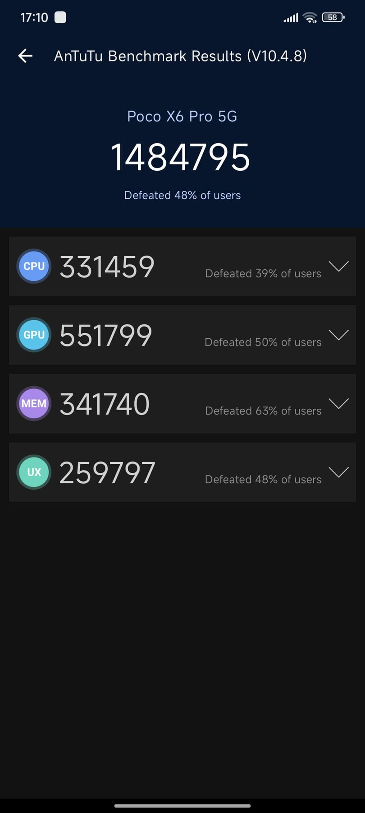
    </p>
</a>

---

### **Custom ROMs for Poco X6 Pro (duchamp)**

#### Android 16 ROMs

| ROM | Version | Android | Status | GApps | Maintainer |
| :---: | :--- | :-: | :---: | :--- | :--- |
| **AxionOS** | v2.2.1 <br> (17-Dec-2025) | 16 | Official | Included | @Saikrishna1504 |
| **VoltageOS** | v5.3 <br> (03-Dec-2025) | 16 | Unofficial | Vanilla | @Saikrishna1504 |
| **Lunaris** | v3.6 <br> (12-Dec-2025) | 16 | Unofficial | Vanilla | @luxured |
| **EvolutionX** | v11.5 <br> (11-Dec-2025) | 16 | Unofficial | Included | @MT6897A |
| **PixelOS** | Baklava <br> (11-Dec-2025) | 16 | Unofficial | Vanilla | @Jose_Mirinda |
| **RisingOS** | v8.1.1 <br> (03-Dec-2025) | 16 | Unofficial | Included | @adarsh_8300u |
| **InfinityX** | v3.4 <br> (11-Nov-2025) | 16 | Unofficial | Included | @stepoff_buddy |
| **LumineDroid** | Bynx <br> (13-Nov-2025) | 16 | Official | Vanilla | @luxured |
| **CrDroid** | Baklava <br> (07-Nov-2025) | 16 | Unofficial | Vanilla | @DavDroid |
| **DerpFest** | A16 <br> (14-Oct-2025) | 16 | Unofficial | Vanilla | @kemjipsu |
| **Clover** | A16 <br> (15-Oct-2025) | 16 | Unofficial | Vanilla | @kemjipsu |
| **MistOS** | Mizzle v4.1 | 16 | Unofficial | MINI | @AkariYO |

#### Android 15 ROMs

| ROM | Version | Android | Status | GApps | Maintainer |
| :---: | :--- | :-: | :---: | :--- | :--- |
| **AxionOS** | v1.6 <br> (21-Jul-2025) | 15 | Official | Included | @Saikrishna1504 |
| **YAAP** | 15 <br> (18-Jul-2025) | 15 | Unofficial | MicroG | @zenin1504 |
| **LineageOS** | 22.2 <br> (16-Jul-2025) | 15 | Unofficial | Vanilla | @rio113 |
| **VoltageOS** | v4.5 <br> (14-Jul-2025) | 15 | Unofficial | Vanilla | @Saikrishna1504 |
| **InfinityX** | v2.9 <br> (06-Jul-2025) | 15 | Unofficial | Included | @zyzzbrahhhh |
| **RisingOS** | v7.1 <br> (01-Jul-2025) | 15 | Unofficial | Included | @adarsh_8300u |
| **HorizonDroid** | 5.4 <br> (22-Jun-2025) | 15 | Unofficial | Both | @Jose_Mirinda |
| **MistOS** | 3.5 Drizzle <br> (21-Jun-2025) | 15 | Unofficial | MINI | @AkariYO |

> **Disclaimer:** Flashing custom ROMs can risk your device. Backup data and follow instructions.

### How to Flash AOSP ROMs

```sh
# Flash recovery
fastboot flash vendor_boot_ab vendor_boot.img

# Reboot to recovery
fastboot reboot recovery

# Sideload ROM (from recovery, after selecting "Apply update via ADB")
adb sideload ROM.zip
```


### **Android 16 ROMs - Detailed Information**
---

### 1. AxionOS v2.2.1 (Android 16)
<a href="src/axionos_a16.png" target="_blank">
    <p align="left">
        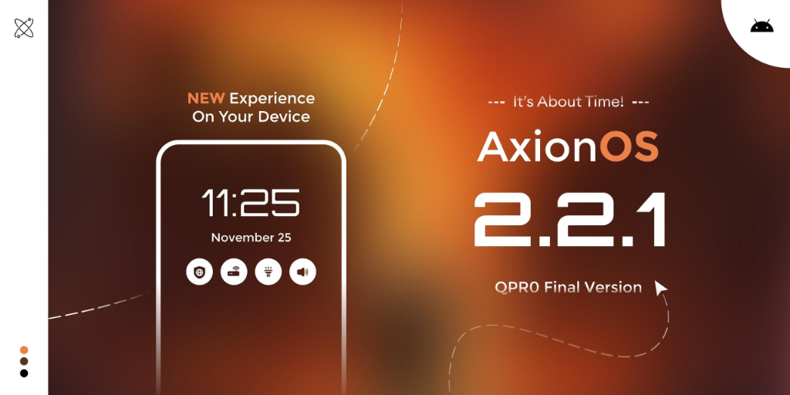
    </p>
</a>

- **Status:** OFFICIAL
- **Android Version:** 16
- **Release Date:** 2025-12-17
- **Maintainer:** @Saikrishna1504
- **GApps Type:** Included (GMS)
- **Downloads:**
    - **Primary:** [devuploads.com](https://devuploads.com/ah8ti2b324ny)
    - **Mirror:** [sourceforge.net](https://sourceforge.net/projects/axionosduchamp/files/axion-2.2.1-NIGHTLY-20251217-OFFICIAL-GMS-duchamp.zip/download)
    - **Recovery:** [t.me](https://t.me/c/3483505718/12632)
- **Flashing Guide:** [t.me](https://t.me/c/3483505718/12616)
- **Support:** [t.me](https://t.me/+xmjLTDXvwZoyOTJl)
- **Notes:**
    - Official Android 16 build - QPRO Final Version.
    - It's About Time!
- **Changelogs:**
    - **Device Changelog (v2.2.1):**
        - Updated to Android 16.
        - OSS Kernel improvements.
        - V4A and MiuiCamera included.
    - **Source Changelog (v2.2.1):**
        - [GitHub Changelog](https://github.com/AxionAOSP/axion_changelogs)
- **Screenshots:** [t.me](https://t.me/AxionOS_android/107?single)

---

### 2. VoltageOS v5.3 (Android 16)
<a href="src/voltageos_a16.png" target="_blank">
    <p align="left">
        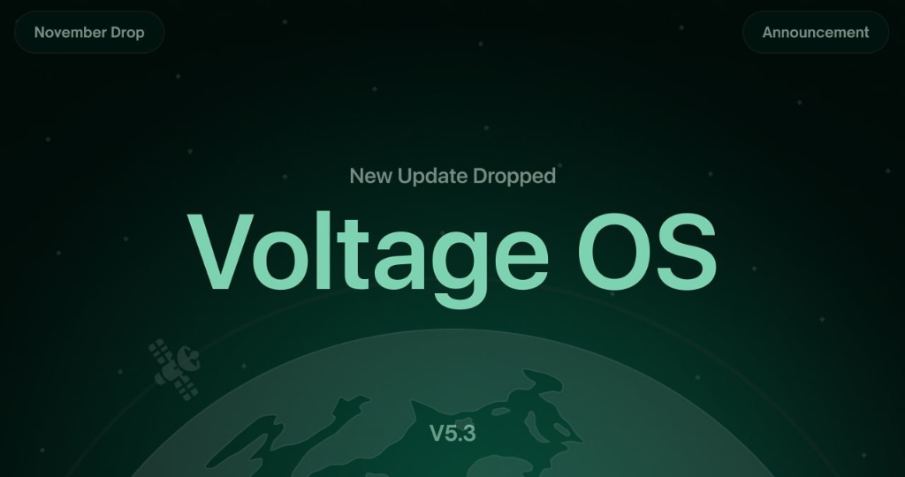
    </p>
</a>

- **Status:** UNOFFICIAL
- **Android Version:** 16
- **Release Date:** 2025-12-03
- **Maintainer:** @Saikrishna1504
- **GApps Type:** Vanilla (Sandboxed GApps available)
- **Downloads:**
    - **ROM:** [devuploads.com](https://devuploads.com/11zekrsu2acr)
    - **Mirror:** [sourceforge.net](https://sourceforge.net/projects/vosduchamp/files/voltage-5.3-duchamp-20251203-1006-UNOFFICIAL.zip/download)
    - **Recovery:** [t.me](https://t.me/sai26918/557975?single)
    - **GApps Options:** [Sandboxed](http://t.me/voltageos/68441) or [MindTheGapps](https://github.com/MindTheGapps/16.0.0-arm64)
- **Flashing Guide:** [t.me](https://t.me/sai26918/399038)
- **Support:** [t.me](https://t.me/sai26918)
- **Notes:**
    - Android 16 build - November Drop.
    - OTA updates available.
- **Changelogs:**
    - **Device Changelog:** [GitHub](https://raw.githubusercontent.com/Saikrishna1504/OTA/refs/heads/16/changelog_duchamp.txt)
    - **Source Changelog:** [t.me](https://t.me/voltageosannouncements/573)
- **Screenshots:** [t.me](https://t.me/sai_hub/350)

---

### 3. Lunaris AOSP v3.6 (Android 16)
<a href="src/lunaris.png" target="_blank">
    <p align="left">
        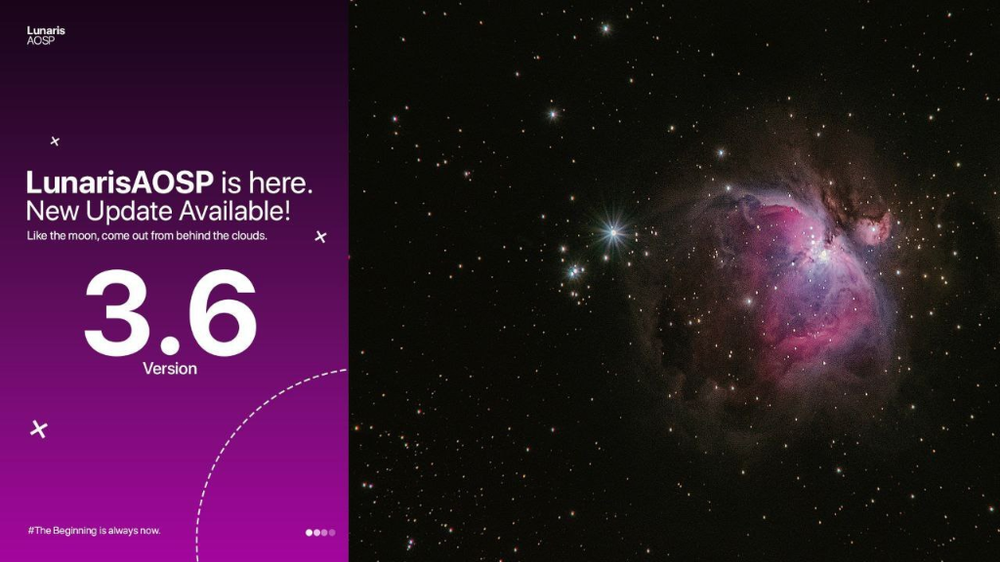
    </p>
</a>

- **Status:** UNOFFICIAL
- **Android Version:** 16
- **Release Date:** 2025-12-12
- **Maintainer:** @luxured
- **GApps Type:** Vanilla (Requires GApps)
- **Downloads:**
    - **Primary:** [drive.google.com](https://drive.google.com/open?id=1Nq0EmiqDU7OMgNqUSoMrHPfFc9nw3PvA)
    - **Mirror:** [drive.serverhive.in](https://drive.serverhive.in/drive/2ka4jcosZ3byEDEeFH9FDMzx/duchamp/2025-12-12/Lunaris-AOSP-duchamp-Community-3.6-Core-2025121212.zip)
- **Flashing Guide:** [t.me](https://t.me/pocox6pro_discussion/86063)
- **Notes:**
    - Clean flash required.
    - "Like the moon, come out from behind the clouds."
    - #TheBeginning is always now.
- **Changelogs:**
    - **Source Changelog:** [t.me](https://t.me/lunaris_dailyUP)
- **Screenshots:** [t.me](https://t.me/bootromteam/126?single)

---

### 4. EvolutionX v11.5 (Android 16)
<a href="src/evolutionx.png" target="_blank">
    <p align="left">
        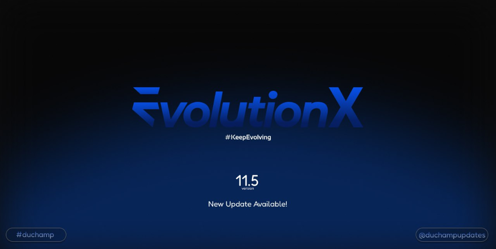
    </p>
</a>

- **Status:** UNOFFICIAL
- **Android Version:** 16 (QPR1)
- **Release Date:** 2025-12-11
- **Maintainer:** @MT6897A
- **GApps Type:** Included (GMS)
- **Downloads:**
    - **Primary:** [drive.google.com](https://drive.google.com/open?id=1ejeeXXzkV4BauUiudx1V94r2BkZPIN3Y)
    - **Mirror:** [drive.serverhive.in](https://drive.serverhive.in/drive/2ka4jcosZ3byEDEeFH9FDMzx/duchamp/2025-12-11/EvolutionX-16.0-20251211-duchamp-11.5-Unofficial.zip)
- **Flashing Guide:** [t.me](https://t.me/pocox6pro_discussion/86063)
- **Notes:**
    - #KeepEvolving
    - Clean flash recommended.
    - Ready - 11.5
- **Changelogs:**
    - **Device Changelog:** [Telegraph](https://telegra.ph/Evox-115-Changelog-12-12)
- **Screenshots:** [t.me](https://t.me/bootromteam/111)

---

### 5. PixelOS Baklava (Android 16)
<a href="src/pixelos.png" target="_blank">
    <p align="left">
        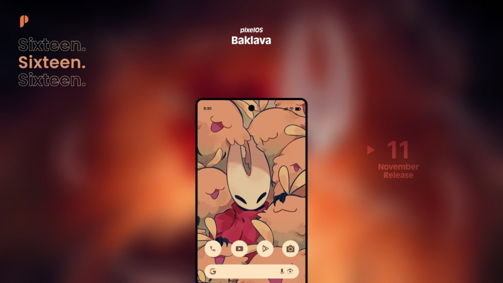
    </p>
</a>

- **Status:** UNOFFICIAL
- **Android Version:** 16 (QPR1)
- **Release Date:** 2025-12-11
- **Maintainer:** @Jose_Mirinda
- **GApps Type:** Vanilla (Requires GApps)
- **Downloads:**
    - **Primary:** [drive.google.com](https://drive.google.com/drive/folders/1PlTFCbkrDxSU6vMBxFDe7BP0zGEOLA62?usp=sharing)
- **Flashing Guide:** [t.me](https://t.me/pocox6pro_discussion/86063)
- **Support:** [t.me](https://t.me/duchamp_discusiones)
- **Notes:**
    - Android 16 QPR1 build - Baklava.
    - Must flash GApps separately.
    - Sixteen. Sixteen. Sixteen.
- **Changelogs:**
    - **Source Changelog:** [blog.pixelos.net](https://blog.pixelos.net/changelogs/)
- **Screenshots:** [t.me](https://t.me/duchamp_discusiones/308449)

---

### 6. RisingOS Revived v8.1.1 (Android 16)
<a href="src/risingos_a16.png" target="_blank">
    <p align="left">
        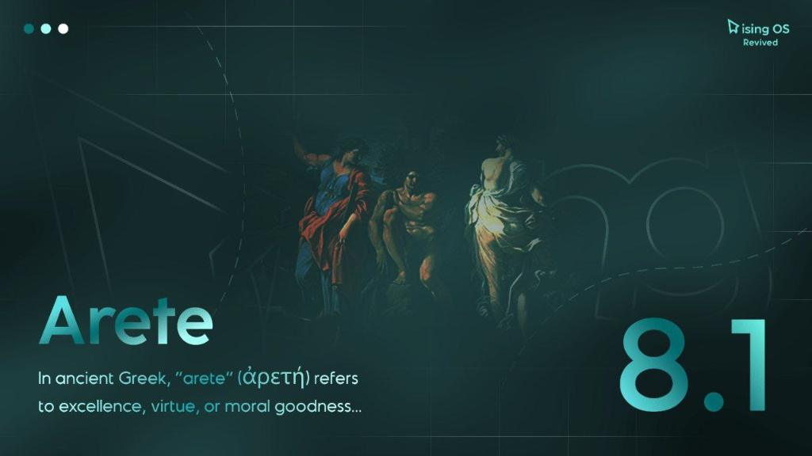
    </p>
</a>

- **Status:** UNOFFICIAL
- **Android Version:** 16
- **Release Date:** 2025-12-03
- **Maintainer:** @adarsh_8300u
- **GApps Type:** Included (GMS)
- **Downloads:**
    - **Primary:** [sourceforge.net](https://sourceforge.net/projects/adarsh8300u/files/AOSP_Duchamp/RisingOS/RisingOS_Revived-8.1.1-GAPPS-COMMUNITY-duchamp.zip/download)
    - **Mirror:** [drive.google.com](https://drive.google.com/open?id=19gV4EBqr6E04NkLCpXI3KhvYpAHNF478)
- **Flashing Guide:** [t.me](https://t.me/hyperosandaospbyadarsh/102945)
- **Support:** [t.me](https://t.me/hyperosandaospbyadarsh)
- **Notes:**
    - Arete 8.1 - In ancient Greek, "arete" (ἀρετή) refers to excellence, virtue, or moral goodness.
- **Changelogs:**
    - Updated to Android 16.
    - Various bug fixes and improvements.
- **Screenshots:** [t.me](https://t.me/hyperosandaospbyadarsh/139778?single)

---

### 7. Project InfinityX v3.4 (Android 16)
<a href="src/infinityx.png" target="_blank">
    <p align="left">
        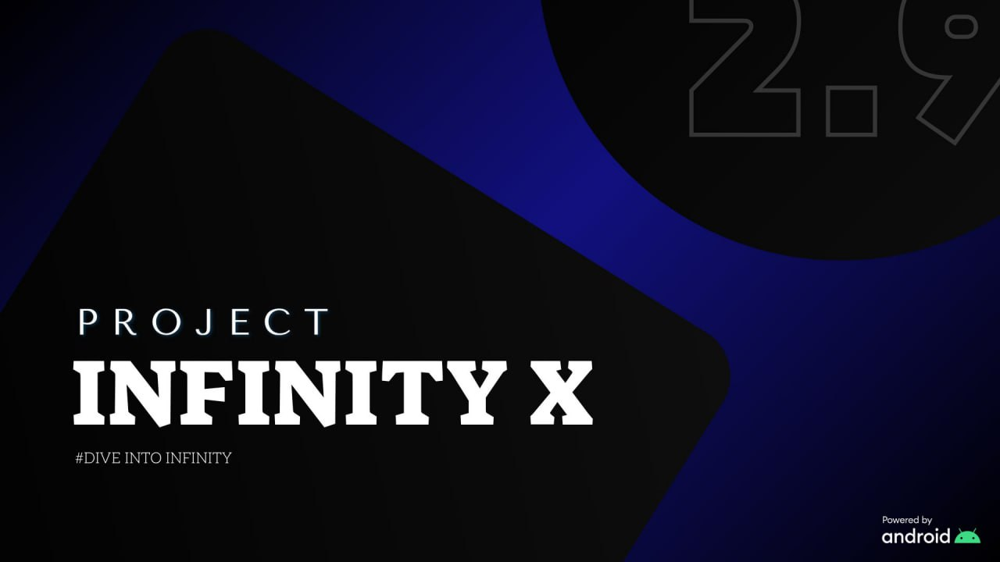
    </p>
</a>

- **Status:** UNOFFICIAL
- **Android Version:** 16
- **Release Date:** 2025-11-11
- **Maintainer:** @stepoff_buddy
- **GApps Type:** Included (GMS)
- **Downloads:**
    - **Primary:** [drive.google.com](https://drive.google.com/file/d/1Rmqrz4O7wDmek7cZvfWDkk-HWsco-pON/view?usp=sharing)
    - **Mirror 1:** [drive.serverhive.in](https://drive.serverhive.in/drive/CfRRMXOYgQTThF0Fz6AwsCRK/duchamp/2025-11-11/Project_Infinity-X-3.4-duchamp-11.11.2025-GAPPS-UNOFFICIAL.zip)
    - **Mirror 2:** [drive.google.com](https://drive.google.com/open?id=168FZiq0zwjHFZHyA4i0d1B5aZUf_cXOV)
- **Flashing Guide:** [Telegraph](https://telegra.ph/How-to-flash-AOSP-ROMs-04-13)
- **Support:** [t.me](https://t.me/Atharva_Dump_Updates)
- **Notes:**
    - Android 16 build.
    - Enforcing & User Build.
- **Changelogs:**
    - **Source Changelog:** [t.me](https://t.me/ProjectInfinityX/1610)
    - **Device Changelog:** [GitHub](https://github.com/Atharva-Agnihotri7115/changelog_duchamp/blob/main/infinity_changelog.md)
- **Screenshots:** [t.me](https://t.me/Atharva_Dump_Updates/18)

---

### 8. LumineDroid Bynx (Android 16)
<a href="src/luminedroid.png" target="_blank">
    <p align="left">
        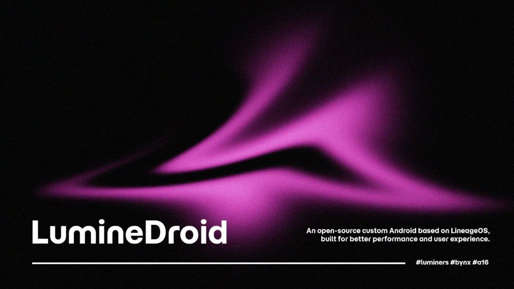
    </p>
</a>

- **Status:** OFFICIAL
- **Android Version:** 16
- **Release Date:** 2025-11-13
- **Maintainer:** @luxured
- **GApps Type:** Vanilla (Requires GApps)
- **Downloads:**
    - **Primary:** [sourceforge.net](https://sourceforge.net/projects/luminedroid/files/duchamp/bynx/LumineDroid-bynx-20251113-OFFICIAL-duchamp.zip/download)
    - **Mirror:** [pixeldrain.com](https://pixeldrain.com/l/vUk6fktm)
- **Notes:**
    - Official Android 16 build - Bynx.
    - An open-source custom Android based on LineageOS, built for better performance and user experience.
    - #luminers #bynx #a16
- **Changelogs:**
    - **Source Changelog:** [t.me](https://t.me/LumineDroidNews/173)
    - **Device Changelog:** [GitHub](https://raw.githubusercontent.com/LumineDroid-Devices/official_devices/refs/heads/bynx/changelogs/duchamp.txt)
- **Screenshots:** [t.me](https://t.me/aospbyluxured/119073)

---

### 9. CrDroid Baklava (Android 16)
<a href="src/crdroid.png" target="_blank">
    <p align="left">
        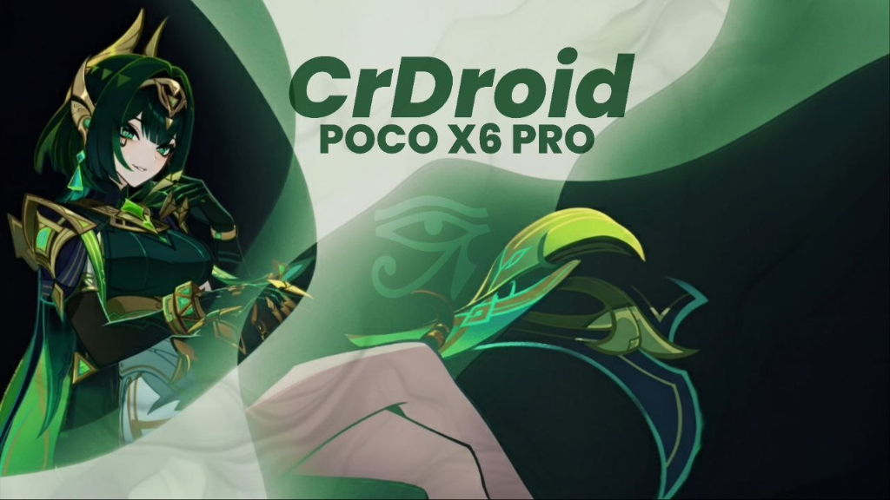
    </p>
</a>

- **Status:** UNOFFICIAL
- **Android Version:** 16
- **Release Date:** 2025-11-07
- **Maintainer:** @DavDroid
- **GApps Type:** Vanilla (Requires GApps)
- **Downloads:**
    - **ROM:** [drive.google.com](https://drive.google.com/uc?export=download&id=1yMp4wBh0AzOgAJvX6nsHQZr-TUZhf2hD)
    - **Recovery:** [drive.google.com](https://drive.google.com/uc?export=download&id=1AzH_57nR-r8ZHmovLg_vIXu_qbL9AHMl)
    - **Required GApps:** [MindTheGapps](https://github.com/MindTheGapps/16.0.0-arm64/releases/tag/MindTheGapps-16.0.0-arm64-20250812_214353)
- **Flashing Guide:** [t.me](https://t.me/pocox6pro_discussion/86063)
- **Notes:**
    - Android 16 build - Baklava variant.
    - Clean flash recommended.
- **Screenshots:** [t.me](https://t.me/duchampdiscusiones/288255?single)

---

### 10. DerpFest (Android 16)
<a href="src/derpfest.png" target="_blank">
    <p align="left">
        
    </p>
</a>

- **Status:** UNOFFICIAL
- **Android Version:** 16
- **Release Date:** 2025-10-14
- **Maintainer:** @kemjipsu
- **GApps Type:** Vanilla (Requires GApps)
- **Downloads:**
    - **Primary:** [pixeldra.in](https://pixeldra.in/l/wEP4FgxG)
- **Flashing Guide:** [t.me](https://t.me/jikembuh/5)
- **Support:** [t.me](https://t.me/+-DxeisoNhwI1Mjk9)
- **Notes:**
    - Android 16 build.
    - Clean flash recommended.
- **Changelogs:**
    - **Device Changelog:** [GitHub](https://github.com/Kaedo17/device-xiaomi-duchamp-changelogs/blob/main/README.md)
    - **Source Changelog:** [t.me](https://t.me/DerpFestAOSP)

---

### 11. Clover Project (Android 16)
<a href="src/clover.png" target="_blank">
    <p align="left">
        
    </p>
</a>

- **Status:** UNOFFICIAL
- **Android Version:** 16
- **Release Date:** 2025-10-15
- **Maintainer:** @kemjipsu
- **GApps Type:** Vanilla (Requires GApps)
- **Downloads:**
    - **Primary:** [pixeldra.in](https://pixeldra.in/u/7Pp5Ew6d)
- **Flashing Guide:** [t.me](https://t.me/jikembuh/5)
- **Support:** [t.me](https://t.me/+-DxeisoNhwI1Mjk9)
- **Notes:**
    - Android 16 build.
    - Clean flash recommended.
    - Visit: thecloverproject.com
- **Changelogs:**
    - **Device Changelog:** [GitHub](https://github.com/Kaedo17/device-xiaomi-duchamp-changelogs/blob/main/README.md)
    - **Source Changelog:** [t.me](https://t.me/The_Clover_Project)

---

### 12. MistOS Mizzle v4.1 (Android 16)
<a href="src/mistos_a16.png" target="_blank">
    <p align="left">
        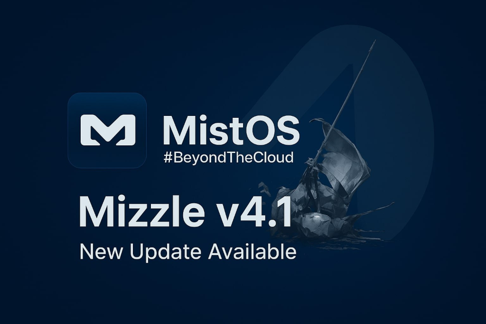
    </p>
</a>

- **Status:** UNOFFICIAL
- **Android Version:** 16
- **Release Date:** Latest
- **Maintainer:** @AkariYO
- **GApps Type:** MINI (included)
- **Downloads:**
    - **Primary:** [sourceforge.net](https://sourceforge.net/projects/patatateam/files/MistOS/Duchamp/)
- **Notes:**
    - #BeyondTheCloud
    - Mizzle v4.1 - New Update Available
- **Changelogs:**
    - Updated to Android 16.
    - Various improvements and optimizations.

---

### **Android 15 ROMs - Detailed Information**
---

### 13. AxionOS v1.6 (Android 15)
<a href="src/axiom.png" target="_blank">
    <p align="left">
        
    </p>
</a>

- **Status:** OFFICIAL
- **Android Version:** 15
- **Release Date:** 2025-07-21
- **Maintainer:** @Saikrishna1504
- **GApps Type:** Included (GMS)
- **Downloads:**
    - **Primary:** [devuploads.com](https://devuploads.com/lrg76g0vg5r9)
    - **Mirror:** [sourceforge.net](https://sourceforge.net/projects/axionosduchamp/files/axion-1.6-FINAL-20250721-OFFICIAL-GMS-duchamp.zip/download)
- **Notes:**
    - Initial Official build.
- **Changelogs:**
    - **Device Changelog (v1.6):**
        - Final A15 Build.
        - Switched to OSS Kernel.
        - V4A and MiuiCamera included.
        - Imported missing display properties.
        - Fixed colors fading.
        - Dropped HotwordEnrollment Apks.
    - **Source Changelog (v1.6):**
        - **Bug Fixes:** Fixed lockscreen album art, removed non-working navbar pulse, fixed QuickSettings UI inconsistencies.
        - **UI Improvements:** Improved doze/AOD and dt2s animations.
        - **System Optimizations:** System latency performance optimizations, CPU scheduling enhancements, added Completely Fair Scheduler (CFS) control, improved idle cooling.
        - **Features:** Added option to adjust status bar padding.

---

### 14. YAAP-15
<a href="src/yaap.png" target="_blank">
    <p align="left">
        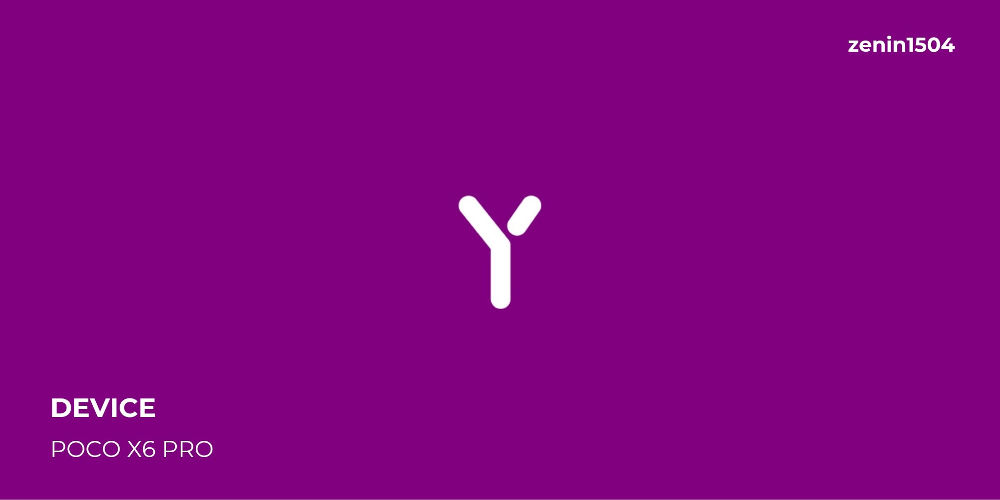
    </p>
</a>

- **Status:** UNOFFICIAL
- **Android Version:** 15
- **Release Date:** 2025-07-18
- **Maintainer:** @zenin1504
- **GApps Type:** Included (MicroG - De-Googled)
- **Downloads:**
    - **Primary:** [github.com](https://github.com/Neon-Duchamp/YAAP/releases/tag/YAAP-15-HOMEMADE-duchamp-20250717)
- **Notes:**
    - Do not flash GApps; the ROM is de-googled and includes MicroG by default.
    - Root is included in the ROM.
- **Changelogs:**
    - **Device Changelog (2025-07-20):**
        - Added support for A/B perf mode for faster OTAs.
        - Disabled native stats.
        - Fixed VoWiFi on airplane mode.
        - Added display burn-in protection.
        - Fixed GCam 4k video and blurry portrait mode.
        - Addressed some SELinux denials.
    - **Device Changelog (2025-07-18 - Initial Release):**
        - Updated OSS kernel.
        - Reworked DT2W (Note: will not work for focaltech devices).
        - Added Core Control, Turbo Charging, and Dolby Atmos.
        - Fixed fatal crashes and high CPU usage related to Dolby.

---

### 15. LineageOS 22.2
<a href="src/los.png" target="_blank">
    <p align="left">
        
    </p>
</a>

- **Status:** UNOFFICIAL
- **Android Version:** 15
- **Release Date:** 2025-07-16
- **Maintainer:** @rio113
- **GApps Type:** Vanilla (Requires GApps)
- **Downloads:**
    - **ROM:** [github.com](https://github.com/mt6897-devs/OTA/releases/latest)
    - **Required GApps:** [MindTheGapps](https://github.com/MindTheGapps/15.0.0-arm64/releases/latest)
- **Notes:**
    - Must be flashed from LineageOS recovery.
- **Changelogs:**
    - Fixed 30Hz bug for focaltech panel.
    - Properly fixed WPA3.
    - Fixed random reboots.
- **Known Bugs:**
    - The front camera may not work on some devices.

---

### 16. VoltageOS v4.5 (Android 15)
<a href="src/vos.png" target="_blank">
    <p align="left">
        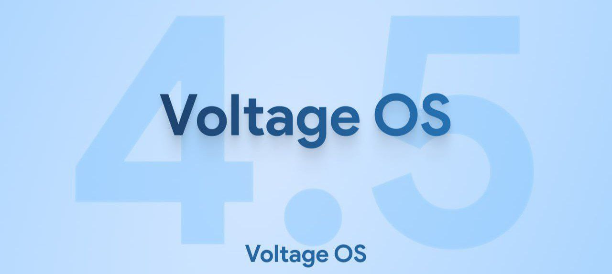
    </p>
</a>

- **Status:** UNOFFICIAL
- **Android Version:** 15
- **Release Date:** 2025-07-14
- **Maintainer:** @Saikrishna1504
- **GApps Type:** Vanilla (Sandboxed GApps available)
- **Downloads:**
    - **ROM:** [saikrishna1504.github.io](https://saikrishna1504.github.io/roms/)
    - **GApps Options:** Sandboxed or MindTheGapps.
- **Notes:**
    - OTA updates are pushed for this ROM.

---

### 17. Project InfinityX v2.9 (Android 15)
<a href="src/infinityx.png" target="_blank">
    <p align="left">
        
    </p>
</a>

- **Status:** UNOFFICIAL
- **Android Version:** 15
- **Release Date:** 2025-07-06
- **Maintainer:** @zyzzbrahhhh
- **GApps Type:** Included (GMS implied)
- **Downloads:**
    - **Primary:** [drive.google.com](https://drive.google.com/file/d/11Zdk7ikfaEkGFISMEypBuoxP0t_THQHy/view?usp=drivesdk)
- **Notes:**
    - Enforcing & User Build.
    - Screen Off FOD works for *goodix* fingerprint sensors but not for *fpc* sensors.
- **Changelogs:**
    - **Device Changelog (2025-07-13):**
        - Switched to OSS Kernel.
        - Implemented MIUI-style color profiles and fixed color flickering.
        - Fixed Turbo Charge (18W) issues.
        - Fixed Wi-Fi wakelock causing idle battery drain.
        - Removed 30Hz refresh rate and fixed adaptive refresh rate behavior.
    - **Source Changelog (v2.9):**
        - Final Android 15 release from the source.
        - Updated to July 2025 security patch.
        - Added toggle for the revamped (QPR2/A16 style) QS Panel.
        - Suppressed mount errors in recovery.

---

### 18. RisingOS Revived v7.1 (Android 15)
<a href="src/ros.png" target="_blank">
    <p align="left">
        
    </p>
</a>

- **Status:** UNOFFICIAL
- **Android Version:** 15
- **Release Date:** 2025-07-01
- **Maintainer:** @adarsh_8300u
- **GApps Type:** Included (GMS)
- **Downloads:**
    - **Primary:** [sourceforge.net](https://sourceforge.net/projects/adarsh8300u/files/AOSP_Duchamp/RisingOS/RisingOS_Revived-7.1-250630-1051-GAPPS-COMMUNITY-duchamp.zip/download)
    - **Mirror:** [drive.google.com](https://drive.google.com/open?id=1TWsRHiqIwXirI_kSLvY0Xt8UaVYUJc_1)
    - **Recovery:** [t.me](https://t.me/hyperosandaospbyadarsh/105816)
- **Changelogs:**
    - Fixed WPA3 + 6GHz Hotspot.
    - Fixed WiFi wakelock.
- **Known Bugs:**
    - Further bug information is available at a dedicated [Telegram link](https://t.me/hyperosandaospbyadarsh/102939).

---

### 19. HorizonDroid 5.4 "Hyperion"
<a href="src/hyperion.png" target="_blank">
    <p align="left">
        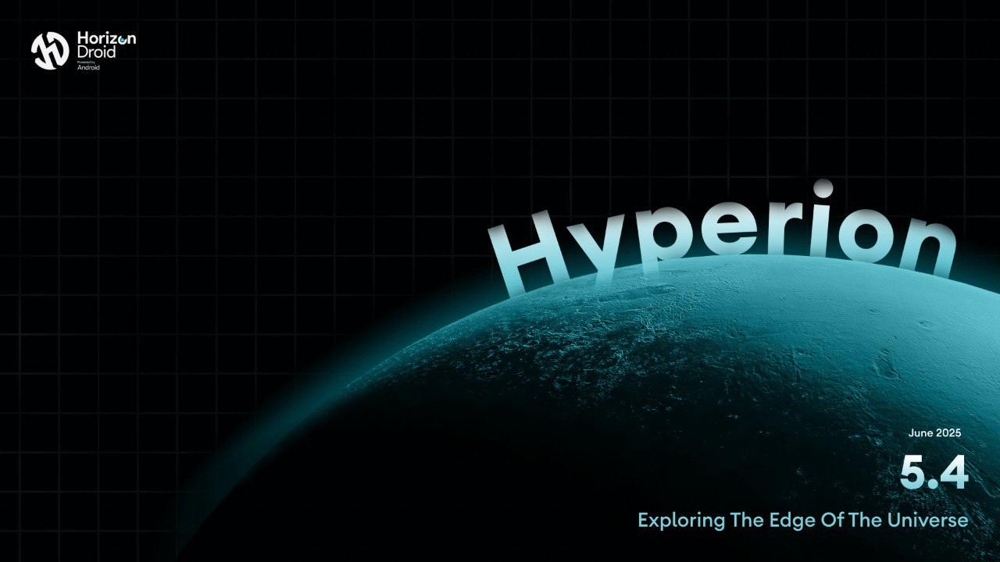
    </p>
</a>

- **Status:** UNOFFICIAL
- **Android Version:** 15
- **Release Date:** 2025-06-22
- **Maintainer:** @Jose_Mirinda
- **GApps Type:** Both (GApps/Vanilla available)
- **Downloads:**
    - **GApps Version:** [drive.google.com](https://drive.google.com/drive/folders/1XgQDQ7D6cQgNmU18rrjiVw65bp-men5h)
    - **Vanilla Version:** [drive.google.com](https://drive.google.com/file/d/1AIkMaYTmJM1E7Ryt52i25RiblTpvldso/view?usp=drivesdk)
- **Notes:**
    - **Warning:** Users with Focaltech screens should not flash this ROM for now.
    - A clean flash is required.
- **Changelogs:**
    - **Device Changelog (2025-06-22):**
        - Partial Kernel OSS.
        - Added Powertools, Bypass Charging, Turbo charging, and High Polling Rate.
    - **Source Changelog (v5.4):**
        - **Features:** Integrated HorizonLab, GameSpace, Face Unlock, and numerous customizations for Status Bar, QS, Lockscreen, and more. Added Per-app volume, Netflix Spoof, Edge Light, and Screen off animations.
        - **Improvements:** Redesigned UDFPS icon and brightness slider, split notifications shade.
        - **Bug Fixes:** Fixed clock seconds, 4G switch, and gesture key issues.

---

### 20. MistOS 3.5 Drizzle (Android 15)
<a href="src/mistos.png" target="_blank">
    <p align="left">
        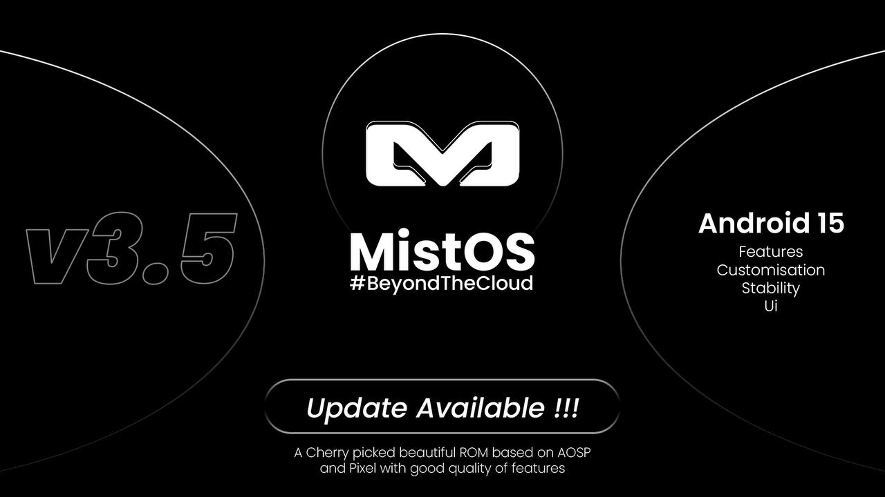
    </p>
</a>

- **Status:** UNOFFICIAL
- **Android Version:** 15
- **Release Date:** 2025-06-21
- **Maintainer:** @AkariYO
- **GApps Type:** MINI (included)
- **Downloads:**
    - **Primary:** [sourceforge.net](https://sourceforge.net/projects/patatateam/files/MistOS/Duchamp/MistOS-3.5-Drizzle-15.0-MINI-20250619-duchamp-UNOFFICIAL.zip/download)
    - **Mirror:** [t.me](https://t.me/shadowsparkledevel/2009)
