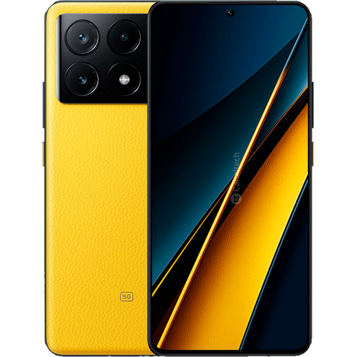

### **Poco X6 Pro (duchamp)**
<a href="src/poco_x6_pro.png" target="_blank">
    <p align="center">
        
    </p>
</a>

---
The Poco X6 Pro stands out in the mid-range market due to its flagship-level performance, primarily driven by the MediaTek Dimensity 8300-Ultra chipset.
|  | **Key Specifications** |
| :--- | :--- |
| **SoC** | MediaTek Dimensity 8300-Ultra (4 nm) |
| **CPU** | Octa-core (1x3.35 GHz Cortex-A715 & 3x3.20 GHz Cortex-A715 & 4x2.20 GHz Cortex-A510) |
| **GPU** | Mali-G615 MC6 |
| **Display** | 6.67" CrystalRes 1.5K Flow AMOLED DotDisplay <br> • 1220 x 2712 pixels (~446 ppi) <br> • 120Hz Refresh Rate, Dolby Vision, HDR10+ <br> • 1800 nits peak brightness |
| **RAM & Storage** | 8GB / 12GB LPDDR5X RAM <br> 256GB / 512GB UFS 4.0 Storage |
| **Main Camera** | • **64 MP** (wide), f/1.7, OIS <br> • **8 MP** (ultrawide), f/2.2 <br> • **2 MP** (macro), f/2.4 |
| **Selfie Camera** | 16 MP (wide), f/2.4 |
| **Battery** | 5000 mAh Li-Po |
| **Charging** | 67W wired, 100% in 45 min (advertised) |
| **Build** | Gorilla Glass 5 front, Plastic or Silicone Polymer (eco-leather) back |
| **Connectivity** | Wi-Fi 6, Bluetooth 5.4, NFC, Infrared Port |

---
### **Benchmark (Antutu v10)**
---
<a href="src/antutu.png" target="_blank">
    <p align="center">
        
    </p>
</a>

---

### **Custom ROMs for Poco X6 Pro (duchamp)**


| ROM | Version | Android | Status | GApps | Maintainer |
| :---: | :--- | :-: | :---: | :--- | :--- |
| **AxionOS** | v1.6 <br> (21-Jul-2025) | 15 | Official | Included | @Saikrishna1504 |
| **YAAP** | 15 <br> (18-Jul-2025) | 15 | Unofficial | MicroG | @zenin1504 |
| **LineageOS** | 22.2 <br> (16-Jul-2025) | 15 | Unofficial | Vanilla | @rio113 |
| **VoltageOS** | v4.5 <br> (14-Jul-2025) | 15 | Unofficial | Vanilla | @Saikrishna1504 |
| **InfinityX** | v2.9 <br> (06-Jul-2025) | 15 | Unofficial | Included | @zyzzbrahhhh |
| **RisingOS** | v7.1 <br> (01-Jul-2025) | 15 | Unofficial | Included | @adarsh_8300u |
| **HorizonDroid** | 5.4 <br> (22-Jun-2025) | 15 | Unofficial | Both | @Jose_Mirinda |
| **MistOS** | 3.5 Drizzle <br> (21-Jun-2025) | 15 | Unofficial | MINI (included) | @AkariYO |

> **Disclaimer:** Flashing custom ROMs can risk your device. Backup data and follow instructions.

### How to Flash AOSP ROMs

```sh
# Flash recovery
fastboot flash vendor_boot_ab vendor_boot.img

# Reboot to recovery
fastboot reboot recovery

# Sideload ROM (from recovery, after selecting "Apply update via ADB")
adb sideload ROM.zip
```


### **Custom ROMs for Poco X6 Pro (duchamp)**
---

### 1. AxionOS v1.6
<a href="src/axiom.png.png" target="_blank">
    <p align="left">
        
    </p>
</a>

- **Status:** OFFICIAL
- **Android Version:** 15
- **Release Date:** 2025-07-21
- **Maintainer:** @Saikrishna1504
- **GApps Type:** Included (GMS)
- **Downloads:**
    - **Primary:** [devuploads.com](https://devuploads.com/lrg76g0vg5r9)
    - **Mirror:** [sourceforge.net](https://sourceforge.net/projects/axionosduchamp/files/axion-1.6-FINAL-20250721-OFFICIAL-GMS-duchamp.zip/download)
- **Notes:**
    - Initial Official build.
- **Changelogs:**
    - **Device Changelog (v1.6):**
        - Final A15 Build.
        - Switched to OSS Kernel.
        - V4A and MiuiCamera included.
        - Imported missing display properties.
        - Fixed colors fading.
        - Dropped HotwordEnrollment Apks.
    - **Source Changelog (v1.6):**
        - **Bug Fixes:** Fixed lockscreen album art, removed non-working navbar pulse, fixed QuickSettings UI inconsistencies.
        - **UI Improvements:** Improved doze/AOD and dt2s animations.
        - **System Optimizations:** System latency performance optimizations, CPU scheduling enhancements, added Completely Fair Scheduler (CFS) control, improved idle cooling.
        - **Features:** Added option to adjust status bar padding.

---

### 2. YAAP-15
<a href="src/yaap.png" target="_blank">
    <p align="left">
        
    </p>
</a>

- **Status:** UNOFFICIAL
- **Android Version:** 15
- **Release Date:** 2025-07-18
- **Maintainer:** @zenin1504
- **GApps Type:** Included (MicroG - De-Googled)
- **Downloads:**
    - **Primary:** [github.com](https://github.com/Neon-Duchamp/YAAP/releases/tag/YAAP-15-HOMEMADE-duchamp-20250717)
- **Notes:**
    - Do not flash GApps; the ROM is de-googled and includes MicroG by default.
    - Root is included in the ROM.
- **Changelogs:**
    - **Device Changelog (2025-07-20):**
        - Added support for A/B perf mode for faster OTAs.
        - Disabled native stats.
        - Fixed VoWiFi on airplane mode.
        - Added display burn-in protection.
        - Fixed GCam 4k video and blurry portrait mode.
        - Addressed some SELinux denials.
    - **Device Changelog (2025-07-18 - Initial Release):**
        - Updated OSS kernel.
        - Reworked DT2W (Note: will not work for focaltech devices).
        - Added Core Control, Turbo Charging, and Dolby Atmos.
        - Fixed fatal crashes and high CPU usage related to Dolby.

---

### 3. LineageOS 22.2
<a href="src/los.png" target="_blank">
    <p align="left">
        
    </p>
</a>

- **Status:** UNOFFICIAL
- **Android Version:** 15
- **Release Date:** 2025-07-16
- **Maintainer:** @rio113
- **GApps Type:** Vanilla (Requires GApps)
- **Downloads:**
    - **ROM:** [github.com](https://github.com/mt6897-devs/OTA/releases/latest)
    - **Required GApps:** [MindTheGapps](https://github.com/MindTheGapps/15.0.0-arm64/releases/latest)
- **Notes:**
    - Must be flashed from LineageOS recovery.
- **Changelogs:**
    - Fixed 30Hz bug for focaltech panel.
    - Properly fixed WPA3.
    - Fixed random reboots.
- **Known Bugs:**
    - The front camera may not work on some devices.

---

### 4. VoltageOS v4.5
<a href="src/vos.png" target="_blank">
    <p align="left">
        
    </p>
</a>

- **Status:** UNOFFICIAL
- **Android Version:** 15
- **Release Date:** 2025-07-14
- **Maintainer:** @Saikrishna1504
- **GApps Type:** Vanilla (Sandboxed GApps available)
- **Downloads:**
    - **ROM:** [saikrishna1504.github.io](https://saikrishna1504.github.io/roms/)
    - **GApps Options:** Sandboxed or MindTheGapps.
- **Notes:**
    - OTA updates are pushed for this ROM.

---

### 5. Project InfinityX v2.9
<a href="src/infinityx.png" target="_blank">
    <p align="left">
        
    </p>
</a>

- **Status:** UNOFFICIAL
- **Android Version:** 15
- **Release Date:** 2025-07-06
- **Maintainer:** @zyzzbrahhhh
- **GApps Type:** Included (GMS implied)
- **Downloads:**
    - **Primary:** [drive.google.com](https://drive.google.com/file/d/11Zdk7ikfaEkGFISMEypBuoxP0t_THQHy/view?usp=drivesdk)
- **Notes:**
    - Enforcing & User Build.
    - Screen Off FOD works for *goodix* fingerprint sensors but not for *fpc* sensors.
- **Changelogs:**
    - **Device Changelog (2025-07-13):**
        - Switched to OSS Kernel.
        - Implemented MIUI-style color profiles and fixed color flickering.
        - Fixed Turbo Charge (18W) issues.
        - Fixed Wi-Fi wakelock causing idle battery drain.
        - Removed 30Hz refresh rate and fixed adaptive refresh rate behavior.
    - **Source Changelog (v2.9):**
        - Final Android 15 release from the source.
        - Updated to July 2025 security patch.
        - Added toggle for the revamped (QPR2/A16 style) QS Panel.
        - Suppressed mount errors in recovery.

---

### 6. RisingOS Revived v7.1
<a href="src/ros.png" target="_blank">
    <p align="left">
        
    </p>
</a>

- **Status:** UNOFFICIAL
- **Android Version:** 15
- **Release Date:** 2025-07-01
- **Maintainer:** @adarsh_8300u
- **GApps Type:** Included (GMS)
- **Downloads:**
    - **Primary:** [sourceforge.net](https://sourceforge.net/projects/adarsh8300u/files/AOSP_Duchamp/RisingOS/RisingOS_Revived-7.1-250630-1051-GAPPS-COMMUNITY-duchamp.zip/download)
    - **Mirror:** [drive.google.com](https://drive.google.com/open?id=1TWsRHiqIwXirI_kSLvY0Xt8UaVYUJc_1)
    - **Recovery:** [t.me](https://t.me/hyperosandaospbyadarsh/105816)
- **Changelogs:**
    - Fixed WPA3 + 6GHz Hotspot.
    - Fixed WiFi wakelock.
- **Known Bugs:**
    - Further bug information is available at a dedicated [Telegram link](https://t.me/hyperosandaospbyadarsh/102939).

---

### 7. HorizonDroid 5.4 "Hyperion"
<a href="src/hyperion.png" target="_blank">
    <p align="left">
        
    </p>
</a>

- **Status:** UNOFFICIAL
- **Android Version:** 15
- **Release Date:** 2025-06-22
- **Maintainer:** @Jose_Mirinda
- **GApps Type:** Both (GApps/Vanilla available)
- **Downloads:**
    - **GApps Version:** [drive.google.com](https://drive.google.com/drive/folders/1XgQDQ7D6cQgNmU18rrjiVw65bp-men5h)
    - **Vanilla Version:** [drive.google.com](https://drive.google.com/file/d/1AIkMaYTmJM1E7Ryt52i25RiblTpvldso/view?usp=drivesdk)
- **Notes:**
    - **Warning:** Users with Focaltech screens should not flash this ROM for now.
    - A clean flash is required.
- **Changelogs:**
    - **Device Changelog (2025-06-22):**
        - Partial Kernel OSS.
        - Added Powertools, Bypass Charging, Turbo charging, and High Polling Rate.
    - **Source Changelog (v5.4):**
        - **Features:** Integrated HorizonLab, GameSpace, Face Unlock, and numerous customizations for Status Bar, QS, Lockscreen, and more. Added Per-app volume, Netflix Spoof, Edge Light, and Screen off animations.
        - **Improvements:** Redesigned UDFPS icon and brightness slider, split notifications shade.
        - **Bug Fixes:** Fixed clock seconds, 4G switch, and gesture key issues.

### 8. MistOS 3.5 Drizzle
<a href="src/mistos.png" target="_blank">
            <p align="left">
                
            </p>
        </a>

- **Status:** UNOFFICIAL
- **Android Version:** 15
- **Release Date:** 2025-06-21
- **Maintainer:** @AkariYO
- **GApps Type:** MINI (included)
- **Downloads:**
    - **Primary:** [sourceforge.net](https://sourceforge.net/projects/patatateam/files/MistOS/Duchamp/MistOS-3.5-Drizzle-15.0-MINI-20250619-duchamp-UNOFFICIAL.zip/download)
    - **Mirror:** [t.me](https://t.me/shadowsparkledevel/2009)
   
